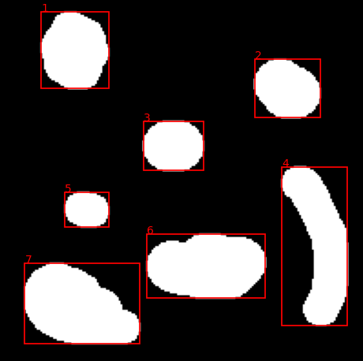
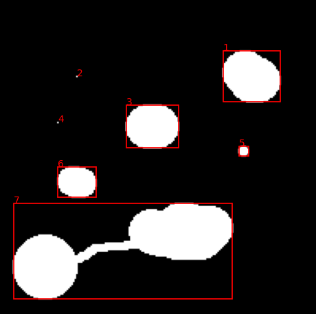
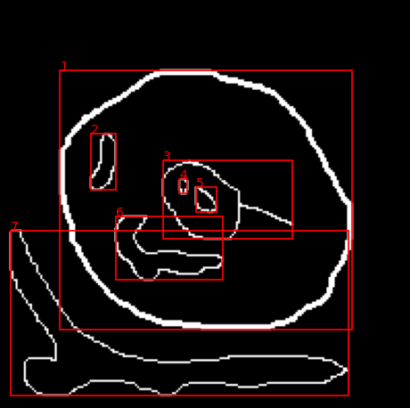

# connected-component
Detection of connected components in an image

This code is an implementation of a Breadth-First Search (BFS) algorithm for indexing connected components in a binary image. It uses the Python libraries `numpy`, `matplotlib`, os, `scipy`, and `PIL` (Python Imaging Library).

How to run:
```console
python3 -m pip install -r requirements.txt
python3 main.py
```

Some testcases:


<div style="display: flex; flex-direction: column; align-items: center;">
    <div style="display: flex; align-items: center;">
        
        <div style="font-size: 30px; margin: 0 30px;">&rarr;</div>
        
    </div>
    <br/>
    <div style="display: flex; align-items: center;">
        
        <div style="font-size: 30px; margin: 0 30px;">&rarr;</div>
        
    </div>
    <br/>
    <div style="display: flex; align-items: center;">
        
        <div style="font-size: 30px; margin: 0 30px;">&rarr;</div>
        
    </div>
    <br/>
</div>
